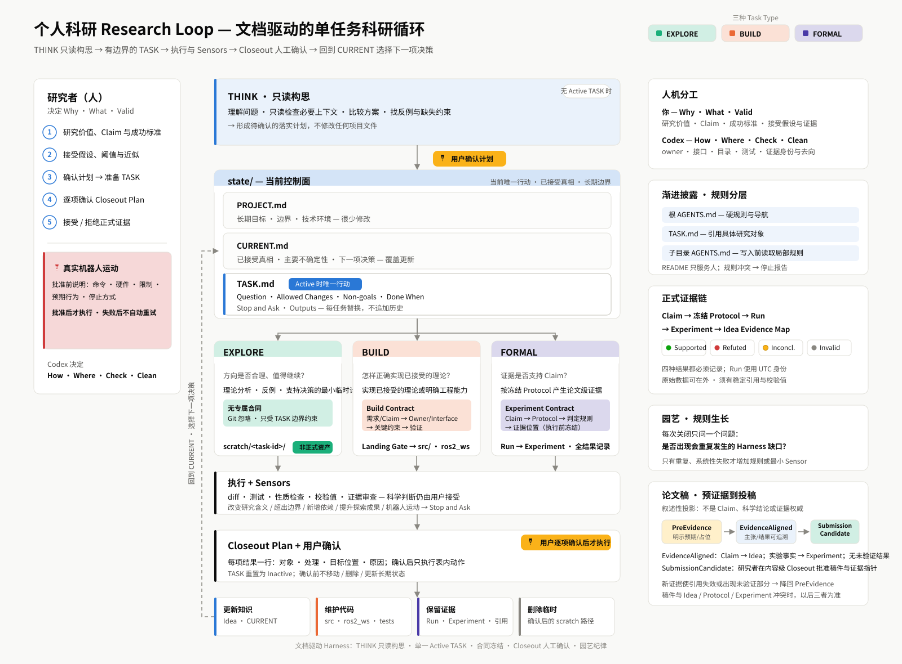

# 科研型 Codex 工作流模板

面向个人机器人研究者、ROS 2、Python、C++ 和真实机器人实验的轻量模板。

> 一次只推进一个研究问题；先构思，再激活一个有边界的任务；临时探索留在项目内但不进入
> 正式代码；正式实验无论结果是否有利都留下记录；Git 保存每次被接受的状态。

## 一分钟理解

整个模板是一条科研循环：

```text
PROJECT / Idea / Claim
        ↓
CURRENT：当前接受了什么？下一项需要决定什么？
        ↓
TASK [EXPLORE | BUILD | FORMAL]
        ↓
Codex 执行 + 检查
        ↓
Closeout Plan + 用户确认
        ↓
更新知识 / 维护代码 / 保留证据 / 删除临时内容
        ↓
回到下一项研究决策
```



[可编辑 SVG](docs/workflow_architecture.svg) · [PNG 预览](docs/workflow_architecture.png)

## THINK：先构思，不执行

没有 Active TASK 时，可以让 Codex：

- 理解研究问题；
- 只读检查必要文档和代码；
- 比较理论或实现方案；
- 找反例和缺失约束；
- 把模糊目标整理成可落实的任务计划。

THINK 不是 Task Type，也不修改项目文件。你确认计划后，再让 Codex 只修改
`state/TASK.md` 准备任务；下一条指令才开始执行。

## 三种 Task Type

| Type | 回答的问题 | 默认工作位置 | 能否成为正式资产 |
|---|---|---|---|
| `EXPLORE` | 方向是否合理、值得继续？ | `scratch/<task-id>/` | 不能，确认后必须重新归类 |
| `BUILD` | 怎样正确实现已接受的理论？ | 任务分支、正式 package | 通过验证和 Closeout 后可以 |
| `FORMAL` | 证据是否支持 Claim？ | 冻结 commit、持久数据位置 | 必须形成 Experiment 记录 |

`EXPLORE` 同时覆盖理论分析和最小临时计算，不再细分探索子类型。项目内的 `scratch/`
默认由 Git 忽略，可以跨对话和重启保留；它不是正式代码或证据。

## 人和 Codex 的分工

```text
你决定：Why / What / Valid
Codex 决定：How / Where / Check / Clean
```

| 研究者负责 | Codex 负责 |
|---|---|
| 研究价值、Claim 和成功标准 | 把目标整理为有边界的 TASK |
| 是否接受假设、阈值和近似 | 提出反例、实现计划和验证方式 |
| 是否切换 Task Type | 选择 owner、接口、依赖方向和文件位置 |
| 是否接受正式证据 | 编写实现、测试、适配和实验入口 |
| 是否执行真实机器人运动 | 管理输出、证据身份和临时代码去向 |

用户不需要记忆 I/P/E/C/T 编号，也不需要先选择代码目录。Codex 从 `CURRENT.md` 和关联
文档解析；存在多个研究含义时讨论含义，不要求用户查编号。

## 最短使用方法

### 0. 第一次使用：建立 Git 基线

模板依赖 Git 来回滚被覆盖的 CURRENT、Idea 和 TASK，并保存每次被接受的关闭状态。复制模板
后先初始化仓库并创建初始提交；提交身份和默认分支由你决定。没有有效 Git 基线时，不开始
BUILD 或 FORMAL。

```bash
git init -b main
git add -A
git commit -m "chore: initialize research harness"
```

### 1. 先构思

```text
我想解决……；目前已知……；最终希望……。
请先检查必要上下文，和我一起形成可执行计划，不修改文件。
```

### 2. 准备任务

```text
我接受这个方案。准备当前 TASK，只修改 state/TASK.md，不执行。
```

### 3. 执行任务

```text
按照当前 TASK 执行。
```

### 4. 接受并关闭

```text
我接受结论。按照 Closeout Plan 执行并关闭 TASK。
```

如果研究问题、Claim、成功判据或 Task Type 改变，应替换 TASK，并建议开启新对话。

## 文件地图

```text
.
├── AGENTS.md              # Codex 的硬规则和导航
├── README.md              # 人类快速入口
├── state/                 # 当前工作控制
│   ├── PROJECT.md         # 稳定目标与边界
│   ├── CURRENT.md         # 对象指针、一句话接受状态与下一决策
│   ├── TASK.md            # 当前唯一行动
│   ├── AGENTS.md          # Codex 的状态与任务规则
│   └── EXAMPLES.md        # 仅在构造格式时读取的完整示例
├── docs/                  # 长期研究知识
│   ├── ideas/             # 理论、Claims、Evidence Map
│   ├── protocols/         # 冻结协议与数据合同
│   ├── references/        # 实际使用的外部资料
│   └── paper/             # 论文直接使用的材料
├── docker/                # 按需创建的可复现环境
├── src/                   # 已接受的 Python 参考实现
├── scratch/               # 项目内持久、Git 忽略的探索
└── reproductions/         # 其他论文实现和来源隔离
```

`ros2_ws/`、`experiments/`、`runs/`、`tools/` 和 `tests/` 只在实际任务需要时创建。
`ARCHITECTURE.md` 只在出现跨正式子系统的稳定依赖方向后创建；真实机器人形成具体运动边界
后再考虑 `SAFETY.md`。

根 README 是给人快速理解工作流的入口，不是 Codex 的任务指令。Codex 自动读取根
`AGENTS.md`；根 AGENTS 再要求它在写入某个子目录前读取最近的子目录 `AGENTS.md`，实现
渐进式披露。

每个现有内容目录都有两份说明：`README.md` 给你快速理解用途和文件去向，`AGENTS.md`
给 Codex 提供局部执行规则。Codex 默认只读取 AGENTS，不读取 README。

## 两种专属合同

EXPLORE 只使用 TASK 的通用边界，不增加合同。

BUILD 使用一个 Build Contract：

```text
Requirement / Claim → Owner / Interface → Constraints → Verification
```

FORMAL 使用一个 Experiment Contract：

```text
Claim → Protocol → Metric / Decision Rule → Evidence Location
```

BUILD 不能替代 FORMAL，EXPLORE 结果也不能自然升级为论文证据。详细格式见
[`state/AGENTS.md`](state/AGENTS.md)。

## 结果去向与 Closeout

任务完成时，Codex 用一张 Closeout Plan 说明每个结果的去向：

| 结果 | 典型处理 |
|---|---|
| 接受的研究结论 | 完整内容写入 Idea；CURRENT 只更新指针和一句话状态 |
| 通过验证的实现 | 进入 `src/`、`ros2_ws/` 或测试 |
| FORMAL 复现资产 | 保留 Experiment、入口、配置和版本引用 |
| 无长期价值的探索 | 用户确认准确路径后从 `scratch/` 删除 |

涉及 CURRENT、Idea 或 Experiment 的行必须展示完整拟写文本或可读 diff，而不是只写“更新”。
删除要列准确路径，提交要列准确文件和 message。用户确认前不移动、删除、提交或更新长期
状态；确认后如果实际 diff 实质变化，Codex 会重新请求批准。TASK 关闭后形成接受提交，并
回到 CURRENT 中的下一项待决定事项。

## 正式证据

```text
Claim → Frozen Protocol → Run → Experiment → Idea Evidence Map
```

FORMAL 把冻结规则的判定与研究者是否接受解释分开记录：协议结果可以是 `Supported`、
`Refuted` 或 `Inconclusive`，研究者验证可以是 `Pending`、`Accepted` 或 `Disputed`。
`Invalid` 实验只能记为 `NotEvaluated`，并说明失效原因；所有结果都保留。Run 使用 UTC 身份
`R-YYYYMMDDTHHMMSSZ-<short-id>`，原始数据可在仓库外，但必须有稳定引用和校验值。

## 真实机器人

任何可能让真实机器人运动的命令都必须先说明：准确命令、硬件和限制、预期行为、停止
方式。只有用户明确批准后才能执行，失败后不自动重试。

## 当前成熟度

该模板目前只完成静态检查，尚未通过真实科研任务 Pilot。每次任务关闭只问一个园艺问题：
是否出现了会重复发生的工作流缺口？只有重复、系统性的失败才增加规则或自动检查。

当前不加入 handoff、多 Agent、执行计划档案、技术债评分、自动编排或定时垃圾回收。
